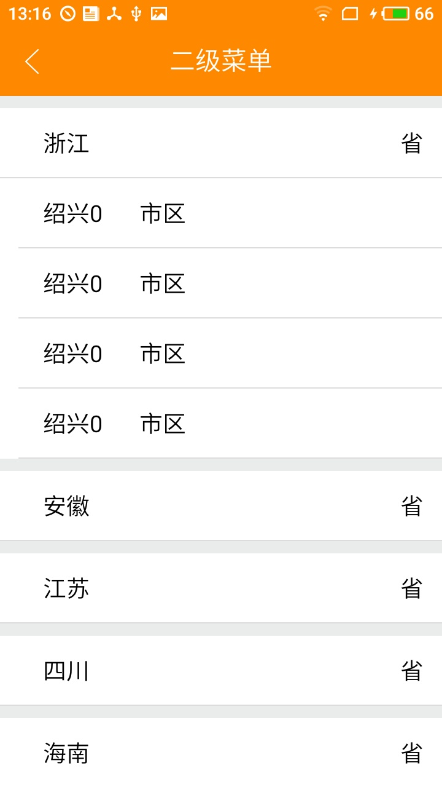

# 基于ExpandableListView的二级树形菜单


 * [基本使用](#介绍)
 * [自定义指示器（箭头）](#自定义指示器（箭头）)
 * [自定义分割线](#自定义分割线)
 * [一次点击只展开一项](#一次点击只展开一项)


## 介绍
ExpandableListView 一种垂直滚动的，展示两级列表的ListView。ExpandableListAdapter 给View提供数据，实例化子布局的适配器。下面我会对ExpandableListAdapter做封装，做成一个通用适配器


## 1.简单布局
```
<?xml version="1.0" encoding="utf-8"?>
<LinearLayout xmlns:android="http://schemas.android.com/apk/res/android"
    android:layout_width="match_parent"
    android:layout_height="match_parent"
    android:orientation="vertical">

    <!--标题-->
    <include layout="@layout/layout_action_toolbar_more" />

    <!--二级菜单-->
    <ExpandableListView
        android:id="@+id/expandable_list_view"
        android:layout_width="match_parent"
        android:layout_height="match_parent" />

</LinearLayout>
```
## 2.初始化测试数据
```
    private List<ProvinceModel>                           mGroupList = new ArrayList<>();//父级
    private List<List<CityModel>>                         mChildList = new ArrayList<>();//子级
    @Override
    protected void initData() {
        setActionTitle("二级菜单");//设置标题
        mGroupList.add(new ProvinceModel("浙江", 1001, "1001", "省"));
        mGroupList.add(new ProvinceModel("安徽", 1002, "1002", "省"));
        mGroupList.add(new ProvinceModel("江苏", 1003, "1003", "省"));
        mGroupList.add(new ProvinceModel("四川", 1004, "1004", "省"));
        String[] citys = new String[] { "绍兴", "湖州", "嘉兴", "杭州" };
        for (int i = 0; i < 4; i++) {
            List<CityModel> itemList = new ArrayList<>();
            itemList.add(new CityModel(citys[i] + i, 2001, "2001", "市区"));
            itemList.add(new CityModel(citys[i] + i, 2002, "2002", "市区"));
            itemList.add(new CityModel(citys[i] + i, 2003, "2003", "市区"));
            itemList.add(new CityModel(citys[i] + i, 2004, "2004", "市区"));
            mChildList.add(itemList);
        }
        mAdapter.notifyDataSetChanged();
    }
```
因为做项目中往往model是各种各样的，所以我自己定义了一个ProvinceModel和CityModel做测试

## 3.创建适配器

```
 mAdapter = new NormalExpandAdapter<ProvinceModel, CityModel>(this, mGroupList, mChildList,
        R.layout.layout_item_group, R.layout.layout_item_child) {
    @Override
    public void groupConvert(ViewHolder helper, ProvinceModel item, boolean isExpanded) {
        helper.setText(R.id.tv_name, item.getName());
        helper.setText(R.id.tv_number, item.getNumber());
    }

    @Override
    public void childConvert(ViewHolder helper, CityModel item) {
        helper.setText(R.id.tv_name, item.getName());
        helper.setText(R.id.tv_number, item.getNumber());
    }
};
```

我们来看这个适配器
  * __1.泛型__
在这里通过泛型来声明父级和子级不同的数据模型
  * __2.布局、数据源参数化__
我们来看new 适配器时传入的五个参数：
    + Context
    + 父级数据源
    + 子级数据源
    + 父级展示的布局
    + 子级展示的布局
  * __3.抽象方法将ViewHolder和Model回调至Activity中渲染父子级布局__
    + ListView中，我们需要加载大量数据，如果每次都创建View，会占用大量的内存，影响性能，所以这里使用了ViewHolder
    + 在getGroupView() 和 getChildView()中，通过抽象方法，将ViewHolder和当前position的Model回调到Activity中使用
    + **这样子就将Adapter封装成一个万能的适配器，不在适配器中做任何渲染UI的操作，不管数据源的Model形式，布局样式，适配器永远一个**
    + 在getGroupView中isExpanded表示当前item是否被选中，将它回调可以用于自定义指示器
```
    @Override
    public View getGroupView(int i, boolean isExpanded, View view, ViewGroup viewGroup) {
        final ViewHolder viewHolder = getGroupViewHolder(i, view, viewGroup);
        groupConvert(viewHolder, getGroup(i),isExpanded);
        return viewHolder.getConvertView();
    }

    @Override
    public View getChildView(int i, int i1, boolean isExpanded, View view, ViewGroup viewGroup) {
        final ViewHolder viewHolder = getChildViewHolder(i, i1, view, viewGroup);
        childConvert(viewHolder, getChild(i, i1));
        return viewHolder.getConvertView();
    }

    @Override
    public boolean isChildSelectable(int i, int i1) {
        return false;
    }

    public abstract void groupConvert(ViewHolder helper, T item, boolean isExpanded);
    public abstract void childConvert(ViewHolder helper, U item);
```

## ViewHolder
  * ViewHolder通常出现在适配器里，为的是listview滚动的时候快速设置值，而不必每次都重新创建很多对象，从而提升性能。


```
/**
 * 通用适配器的布局绑定类
 */
public class ViewHolder {
    private final SparseArray<View> mViews;        //在数据量不大的情况下，使用SparseArray，性能比HashMap更好
    private int                     mGroupPosition;
    private int                     mChildPosition;
    private int                     mLayoutId;
    private View                    mConvertView;

    /**
     * 适用于 一级ListVew
     *
     * @param context
     * @param parent
     * @param layoutId
     * @param mGroupPosition
     */
    ViewHolder(Context context, ViewGroup parent, int layoutId, int mGroupPosition) {
        this.mGroupPosition = mGroupPosition;
        this.mLayoutId = layoutId;
        this.mViews = new SparseArray<View>();
        mConvertView = LayoutInflater.from(context).inflate(layoutId, parent, false);
        // setTag
        mConvertView.setTag(this);
    }

    /**
     * 适用于ExpandableListView
     *
     * @param context
     * @param parent
     * @param layoutId
     * @param mGroupPosition
     * @param mChildPosition
     */
    ViewHolder(Context context, ViewGroup parent, int layoutId, int mGroupPosition,
               int mChildPosition) {
        this.mGroupPosition = mGroupPosition;
        this.mChildPosition = mChildPosition;
        this.mLayoutId = layoutId;
        this.mViews = new SparseArray<View>();
        mConvertView = LayoutInflater.from(context).inflate(layoutId, parent, false);
        // setTag
        mConvertView.setTag(this);
    }

    /**
     * 拿到一个ViewHolder对象
     *
     * @param context
     * @param convertView
     * @param parent
     * @param layoutId
     * @param mGroupPosition
     * @return
     */
    public static ViewHolder get(Context context, View convertView, ViewGroup parent, int layoutId,
                                 int mGroupPosition) {
        if (convertView == null) {
            return new ViewHolder(context, parent, layoutId, mGroupPosition);
        } else {
            ViewHolder holder = (ViewHolder) convertView.getTag();
            holder.mGroupPosition = mGroupPosition;
            return holder;
        }
    }

    /**
     * 拿到一个ViewHolder对象
     *
     * @param context
     * @param convertView
     * @param parent
     * @param layoutId
     * @param mGroupPosition
     * @param mChildPosition
     * @return
     */
    public static ViewHolder get(Context context, View convertView, ViewGroup parent, int layoutId,
                                 int mGroupPosition, int mChildPosition) {
        if (convertView == null) {
            return new ViewHolder(context, parent, layoutId, mGroupPosition, mChildPosition);
        } else {
            ViewHolder holder = (ViewHolder) convertView.getTag();
            holder.mGroupPosition = mGroupPosition;
            holder.mChildPosition = mChildPosition;
            return holder;
        }
    }

    public View getConvertView() {
        return mConvertView;
    }

    /**
     * 通过控件的Id获取对于的控件，如果没有则加入views
     *
     * @param viewId
     * @return
     */
    public <T extends View> T getView(int viewId) {
        View view = mViews.get(viewId);
        if (view == null) {
            view = mConvertView.findViewById(viewId);
            mViews.put(viewId, view);
        }
        return (T) view;
    }

    /**
     * 为TextView设置字符串
     *
     * @param viewId
     * @param text
     * @return
     */
    public ViewHolder setText(int viewId, CharSequence text) {
        TextView view = getView(viewId);
        view.setText(text);
        return this;
    }

    /**
     * 为ImageView设置图片
     *
     * @param viewId
     * @param drawableId
     * @return
     */
    public ViewHolder setImageResource(int viewId, int drawableId) {
        ImageView view = getView(viewId);
        view.setImageResource(drawableId);

        return this;
    }

    /**
     * 加载小图
     *
     * @param viewId
     * @param url
     * @return
     */
    public ViewHolder setSmallImageByUrl(int viewId, String url) {
        if (!TextUtils.isEmpty(url) && url.contains("oos")) {
            url = url + "@80w_80h.jpg";
        }
        //ImageLoader.getInstance().displayImage(url, (ImageView) getView(viewId));
        return this;
    }

    public int getGroupPosition() {
        return mGroupPosition;
    }

    public int getChildPosition() {
        return mChildPosition;
    }

    public int getLayoutId() {
        return mLayoutId;
    }

}
```

## 自定义指示器（箭头）

隐藏左侧箭头
```
 mListView.setGroupIndicator(null);
```

创建一个选择器selector

```
<?xml version="1.0" encoding="utf-8"?>
<selector xmlns:android="http://schemas.android.com/apk/res/android">
    <item android:drawable="@mipmap/indicator_down" android:state_expanded="true" />
    <item android:drawable="@mipmap/indicator_right" />
</selector>
```

使用

```
mListView.setGroupIndicator(getResources().getDrawable(R.drawable.selector_expand_list_indicator));
```

## 指示器显示在右边

 * 1.隐藏左侧箭头
 ```
 mListView.setGroupIndicator(null);
 ```
 * 2.创建在父级的layout中，新增一个ImageView表示箭头
 ```
 <ImageView
         android:id="@+id/img_indicator"
         android:layout_width="30dp"
         android:layout_height="30dp"
         android:scaleType="centerInside"
         android:src="@mipmap/indicator_right"
         android:visibility="gone"
         android:padding="@dimen/dp_10"/>
 ```
 * 3.通过NormalExpandAdapter回调的当前是否选择状态控制箭头的上下

```
mAdapter = new NormalExpandAdapter<ProvinceModel, CityModel>(this, mGroupList, mChildList,
                R.layout.layout_item_group, R.layout.layout_item_child) {
            @Override
            public void groupConvert(ViewHolder helper, ProvinceModel item, boolean isExpanded) {
                helper.setText(R.id.tv_name, item.getName());
                helper.setText(R.id.tv_number, item.getNumber());
                ImageView indicatorImg = helper.getView(R.id.img_indicator);
                indicatorImg.setVisibility(View.VISIBLE);
                //表示当前选中状态，选中箭头向下，未选择状态箭头向上
                if (isExpanded) {
                    indicatorImg.setImageDrawable(getResources().getDrawable(R.mipmap.indicator_down));
                } else {
                    indicatorImg.setImageDrawable(getResources().getDrawable(R.mipmap.indicator_right));
                }
            }

            @Override
            public void childConvert(ViewHolder helper, CityModel item) {
                helper.setText(R.id.tv_name, item.getName());
                helper.setText(R.id.tv_number, item.getNumber());
            }
        };
```

## 自定义分割线

expandableListView的下面两个个属性分别设置groupView和childView的divider
但是dividerHeight同时影响着group和child的divider，所以我们更愿意自己来定义分割线

```
android:childDivider
android:dividerHeight
```

### 我们通过在GroupView和ChildView中添加分割线来实现此功能

 **例如：比如我们要实现下图的效果**



 * 1.在父布局添加一个高度为10dp的View，作为分割每个Group的间隔线
 * 2.在父布局中添加一个高度为1dp的灰色View，作为Group和Child之间的分割线
 * 3.在child布局中，添加一个高度为1dp的灰色View，做为每一个child的分割线

## 一次点击只展开一项

在实际开发中，我们往往会遇到这样的场景，在点击二级菜单时，在某一个groupItem展开的情况下，点击另一个groupItem，其他的groupItem必须收缩，只展开当前点击项

 * 1.添加Group展开监听，关键在于获取当前展开项位置
```
mListView.setOnGroupExpandListener(new ExpandableListView.OnGroupExpandListener() {
     @Override
     public void onGroupExpand(int i) {
         expandOnlyOne(mListView, i, count);
     }
});
```
 * 2.对当前group做一个遍历，如果是当前选择项，展开，否则，收缩
```
// 每次展开一个分组后，关闭其他的分组
private boolean expandOnlyOne(ExpandableListView view, int expandedPosition, int groupLength) {
    boolean result = true;
    for (int i = 0; i < groupLength; i++) {
        if (i != expandedPosition && view.isGroupExpanded(i)) {
            result &= view.collapseGroup(i);
        }
    }
    return result;
}
```


[简书：基于ExpandableListView的二级树形菜单](http://www.jianshu.com/p/651e519799cb)

[Github：基于ExpandableListView的二级树形菜单](https://github.com/HanHuoBin/ExpandViewDemo)